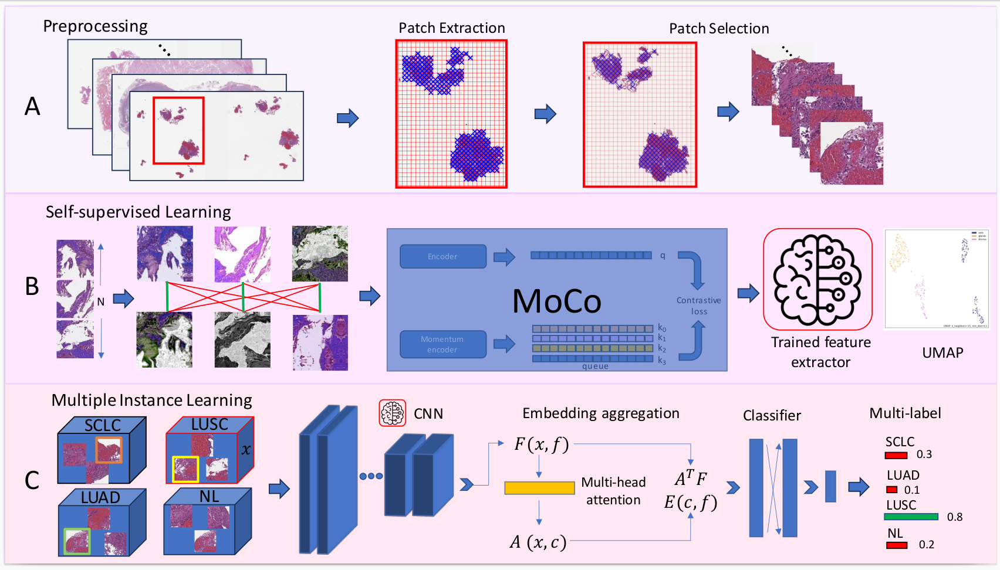
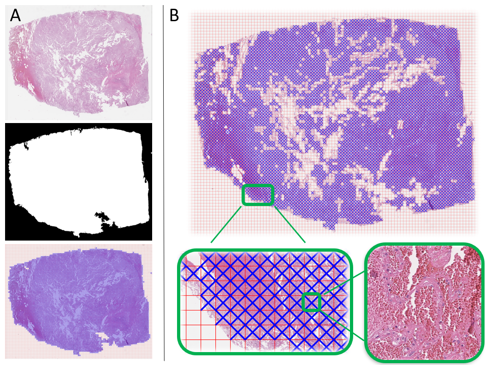
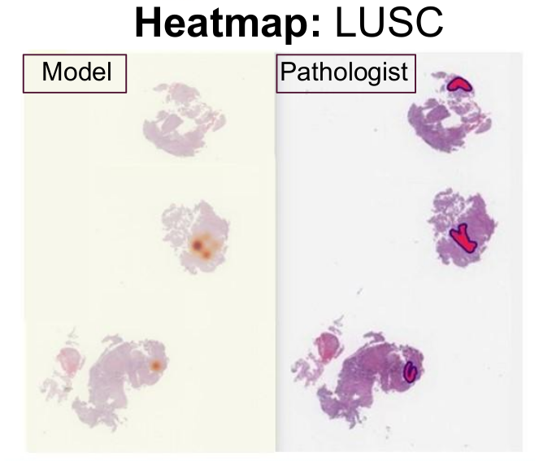

# histo_lung
This repository contains the full pipeline to analyze histopathological lung Whole Slide Images
(WSIs).


Three main steps are performed, Data preprocessing to extract the patches,
 Self-supervision for pre-training and Multiple Instance Learning for training:

 

A CAD system is proposed based on self-supervised pre-training and multiple instance learning
(MIL) training to classify lung WSIs into four classes, three major cancer subtypes, small cell
 lung cancer (SCLC), non-small cell lung cancer, adenocarcinoma (LUAD) and squamous cell carcinoma
 (LUSC) and normal tissue (NL).

## Dataset
The model was used using two private datasets. Ospedaliera per l’Emergenza Cannizzaro Catania (AOEC)
 and Radboud University Medical Centre (RUMC) with a total of 2,226 WSIs and to evaluate the 
 generalization capabilities of th emodel, it was additionally tested on the TCGA LUAD and LUSC
 dataset composed by 1,036 WSIs from 5 different centers.
,
## Setting up the environment
Th is project has 2 different enviroments. One to run the PyHIST reporisitory that also needs to be 
cloned in this repository and the second enviroment that runs all the code in this repository.

### PyHIST cloning and enviroment 
- Clone PyHIST
```
git clone https://github.com/manuel-munoz-aguirre/PyHIST.git
cd PyHIST
```

- Create a conda environment
```
conda create -n pyhist_env python==3.6.13 anaconda -y && conda activate pyhist_env
```
- Install the requirements
```
pip install -r requirements_pyhist.txt
```

### histo_lung enviroment
- Create a conda environment
```
conda create -n hlung_env python==3.9.16 anaconda -y && conda activate hlung_env
```
- Install the requirements
```
pip install -r requirements.txt
```

## Data preprocessing
Preprocessing of the dataset that consists in patching the WSIs in small tildes. There are two main
steps. A. Patch Exatrcation using the PyHIST tool and B. Patch selection to discard false positives.


### Patch extraction
To extract the patches this project uses the PyHIST tool. To tun this step first follow the steps
on *PyHIST cloning and enviroment* in the *Setting up the environment* subsetction. 


```
conda activate pyhist_env
cd PyHIST
python3 pyhist.py --method graph --mask-downsample 8 --output-downsample 2 --tilecross-downsample 32
 --corners 1111 --borders 0000 --percentage-bc 1 --k-const 1000 --minimum_segmentsize 1000 --info
'verbose' --content-threshold 0.2 --patch-size 256 --save-patches --save-mask
 --save-tilecrossed-image --output OUTPUT_DIR INPUT_WSI
```

Using `utils/bash_file_PyHIST-py` script is possible to create a bash file to run the patch
 extraction to all the WSIs in a civen folder.

### Patch selection
Due the high number of false positives (holes and letters) an extra step is performed to remove
these false positives while keeping the true positives looking at the patch's histogrmans.

First is necesarry to extrcat the binary images by running `binarization_pyhist.py`. 
```
conda activate hlung_env
python3 -m preprocessing.filter_patches_pyhist
```

## Metadata creation
For the training a metadata file is created to know all the important information of this WSI such
as dimensions, number of patches, number of filter patches, etc.
```
python3 -m database.metadata_slides
```


## Self-supervised learning
The self-supervised learning is used to train a feature extractor that will be used for the
training. By using the Momentum Contrastive Learning (MoCo). All the inputs necessary to train
the model are selected by using the config file `training/config.yml`
```
python3 -m training.train_MoCo
```

## Multiple Instance Learning
Multiple Instance Learning is used as a weak-supervised learning strategy because in this work we
only use global annotaions for the WSis. Before performing the training is necesarry to exatract
the features of all the patches using the feature extrcator pre-trained using MoCo. All the inputs
 necessary to extrcat the features are selected by using the config file 
 `preprocessing/config_Features.yml`.
```
python3 -m preprocessing.store_features
```
To train de MIL model, All the inputs necessary to train the model are selected by using the config
 file `training/config_MIL.yml`:

```
python3 -m training.train_MIL
```

For the training step of the MIL model, the WSIs coming from both hospitals were divided into train
 and validation following k-fold cross-validation. The training and validation sets are carefully
 split to avoid having images from the same patient in the different sets. The goal is to prove
 the robustness of the model to the selected training data.

 By using `database.data_splits.py` is possible to obtain the splits from as given training dataset
 and `training.train_MIL_k_fold.py` allows to perform th etraining in the k folds.

## Results on the TCGA LUAD AND LUSC datasets

Using this full pipeline and tested on the TCGA dataset the model obtain the following performance
in the 4-class classification problem:


 |  | AUC SCLC | AUC LUAD | AUC LUSC | AUC Normal| micro-AUC | weighted f1-score |
 |---------|----------|-------------| ---------|----------|-------------| -------------|
 | histo_lung   | 1.0 ± 0.0 | 0.8818 ± 0.0163 | 0.8856 ± 0.0179 | 1.0 ± 0.0 | 0.9433 ± 0.0198 | 0.7726 ± 0.0438 |


 ## Heatmaps

 By using `heatmaps/heatmaps.py` tool is possible to obtain the heatmaps of a given WSI. The
 following figure shows the heatmap performed by the model and the annotations from an expert 
 pathologist.


